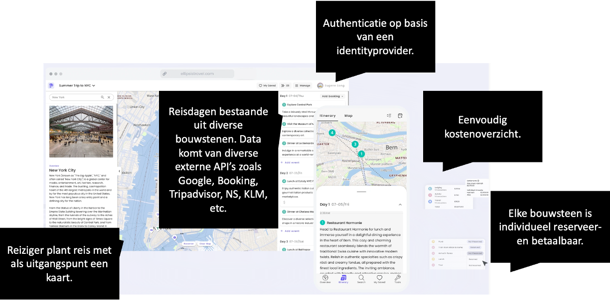

# SOEX Beroepsproduct
Casusbeschrijving voor SOEX: Solution Exploration

## Vakantieplan app: Triptop

Ontwerp een online applicatie waarmee een vakantietrip gepland kan worden, een site waarop je zelf alles bij elkaar klikt. Waar je nu als reiziger naar een (virtueel) reisbureau gaat die alle opties/mogelijkheden voor je uitzoekt en op elkaar afstemt, verschuift die rol van reisagent nu naar de reiziger. De reisagent is daarmee tweedelijns support geworden die je zou kunnen raadplegen als je er zelf niet uitkomt of iemand waarmee je het uiteindelijke reisplan kunt bespreken i.v.m. risico's. Ondanks de [voordelen](https://fd.nl/samenleving/1548189/in-opkomst-het-fysieke-reisbureau?gift=wqenk) van een fysiek reisbureau is de trend dat reizigers steeds meer zelf hun reis samenstellen.

Deze applicatie is geïnspireerd op [Ellipsis Travel](https://www.ellipsistravel.com/), een online reisplatform dat reizen op maat aanbiedt. Triptop is gecharmeerd van dit idee en werd enthousiast van de mogelijkheden die dit platform biedt:

- Reizigers kunnen zelf hun reis samenstellen door verschillende bouwstenen te combineren.
- Reizigers kunnen zelf hun reis boeken.
- Reizigers kunnen zelf hun reis annuleren.
- Reizigers kunnen zelf hun reis aanpassen.
- Reizigers kunnen zelf hun reis betalen.
- Reizigers kunnen hun reisstatus bewaren zonder dat ze een extra account hoeven aan te maken, hiervoor is een centrale _identity provider_ beschikbaar waar je met je Google, Microsoft, AirBnb etc. account op kunt inloggen.

Triptop wil een soortgelijke applicatie ontwikkelen, maar dan gericht op de Nederlandse markt. De userinterface zou veel weg mogen hebben van Ellipsis Travel, maar dan met een Nederlandse touch. Alhoewel het maken van de webapplicatie zelf, in bijzonder het front-end voor deze opdracht buiten scope is geeft de volgende UI-schets een idee van de mogelijkheden:

Een reis bestaat uit verschillende bouwstenen die aan elkaar gekoppeld kunnen worden en die samen een trip vormen waarbij de route langs alle bouwstenen bepaald moet kunnen worden. 

Mogelijke bouwstenen zijn 
- Overnachting (bijv. Booking.com, Airbnb, eigen beheer)
- Vervoer tussen overnachtingen (bijv. treinen via NS of Deutsche Bahn, vliegtuig via KLM)
- Heen en terugreis (eigen vervoer, KLM shuttle, trein)
- Autohuur (bijv. huurauto via Sixt, Hertz)
- Excursies / activiteiten (bijv. via GetYourGuide, Tripadvisor)
- Eten en drinken (bijv. via Takeaway, Eet.nu)

De bouwstenen kunnen verschillende toestanden hebben: 
- Gepland
- Geregeld
- Betaald
- Niet uitvoerbaar
- Uitgevoerd

Elke instantie van een bouwsteen kan verschillende externe services nodig hebben. 
Voorbeeld:

- Overnachtingen: de ene wordt via booking geregeld, de andere is in eigen beheer
- Vervoer tussen de ene twee overnachtingen gaat met de auto (via google maps routeplannen), de andere gaat via de boot (via een veerdienst).

## Opdracht in hoofdlijnen

1. Ontwerp maken waarbij gebruik gemaakt moet worden van C4. Je werkt een of meerdere ontwerpvragen uit die per drietal verschillend zijn waardoor verschillende groepjes verschillende aspecten van de applicatie moeten uitwerken.
2. Design patterns bestuderen en toepassen. 
3. PoC-jes (prototypes) maken van communicatie met één, of twee externe services.

Essentieel in deze casus is dat je niet alleen bedenkt en visualiseert hoe de software eruit moet zien, maar deze plaatjes ook voorziet van tekst waaruit keuzes blijken die je hebt gemaakt en het geheel (een software guidebook) voor een andere ontwikkelaar begrijpelijk is. Daarnaast werk je enkele keuzes uit in de vorm van werkende prototypes. 

## Ontwerpvragen

Gegroepeerd op quality attribute uit het software guidebook:

**Interoperability**
* Hoe kunnen we verschillende betalingssystemen integreren voor de verschillende bouwstenen?
* Hoe kunnen we verschillende externe vervoersservices (zoals Google Maps of een veerdienst API) integreren zonder afhankelijk te worden van hun specifieke implementaties?
* Hoe kunnen we verschillende identity providers met verschillende interfaces integreren voor het gehele systeem?
* Hoe zorg je dat een wijziging in een of meerdere APIs niet leidt tot een grote wijziging in de applicatie? Specifieker: hoe zorg je ervoor dat een wijziging in de API van een externe service niet leidt tot een wijziging in de front-end maar flexibel kan worden opgevangen door de back-end?
* Hoe zorg je ervoor dat je bij een wijziging in de datastructuur van een externe service niet de hele applicatie hoeft aan te passen?
* Wie is verantwoordelijk voor het vertalen van een bericht van een externe service naar een aanroep van het domein?
* Wie roept een specifieke externe service aan, gebeurt dat vanuit de front-end of vanuit de back-end? Welke redenen zijn er om voor de ene of de andere aanpak te kiezen?

**Fault Tolerance**
* Hoe ga je om met aanroepen van externe services die niet beschikbaar zijn en toch verwacht wordt dat er waardevolle output gegeven wordt?
* Hoe kunnen we ervoor zorgen dat bepaalde bouwstenen automatisch een alternatieve dienst kiezen als de primaire dienst niet beschikbaar is?
* Wat doe je als je vanuit Triptop meerdere externe services, of meerdere aanroepen naar dezelfde service, moet aanroepen en de volgorde van aanroepen van belang is?

**Modularity**
* Hoe kunnen we het systeem uitbreiden met nieuwe types activiteiten of excursies zonder de bestaande code te veranderen?
* Hoe zorg je ervoor dat je makkelijk de ene externe service kan vervangen door een andere die ongeveer hetzelfde doet?
* Hoe zorg je ervoor dat je makkelijk een nieuwe externe service kan toevoegen?
* Hoe bied je de gebruiker op basis van zelfgekozen bouwstenen alternatieve bouwstenen aan, bijvoorbeeld als een bepaalde overnachting niet beschikbaar is of om een keuze te geven tussen vervoer per auto, trein of bus?
* Wie is verantwoordelijk voor het creëren van een nieuwe instantie van een bouwsteen? Wie is verantwoordelijk voor het verwijderen van een instantie van een bouwsteen?

**Modifiability**
* Hoe kunnen verschillende boekingsservices (zoals Booking.com en eigen beheer in Triptop) worden geïntegreerd?
* Hoe kunnen we de trip flexibel herplannen als een bepaalde bouwsteen niet uitvoerbaar blijkt?
* Hoe kunnen we dynamisch beslissen of een bouwsteen geboekt moet worden via een externe service of intern beheerd moet worden?
* Hoe maak je de applicatie uitbreidbaar met nieuwe bouwstenen?
* Hoe zorg je voor een zo kort mogelijke reisroute waarbij gebruik gemaakt wordt van alle bouwstenen? Hoe zorg je ervoor dat de reisroute makkelijk aangepast kan worden als reisafstand geen issue is?

**Integrity**
* Hoe kunnen van elkaar afhankelijke bouwstenen in een transactie worden geboekt?
* Hoe kunnen we ervoor zorgen dat een bouwsteen alleen bepaalde acties toestaat wanneer deze zich in een specifieke toestand bevindt?
* Hoe wordt de toestand van de applicatie bijgehouden, is er een centrale toestand of is de toestand van de applicatie verdeeld over de bouwstenen?
* Hoe kunnen we omgaan met de variabele beschikbaarheid van bouwstenen (bijvoorbeeld een excursie kan niet uitvoerbaar zijn)?

**Confidentiality**
* Hoe beheer je veilig de interactie met verouderde externe APIs die geen moderne beveiligingsprotocollen ondersteunen?
* Hoe implementeer je logging van API-aanroepen op een manier die gevoelige informatie niet blootstelt?
* Hoe waarborg je de integriteit van data die via externe APIs wordt verzonden of ontvangen?
* Hoe zorg je ervoor dat authenticatie en autorisatie consistent worden toegepast bij het communiceren met verschillende externe APIs?

