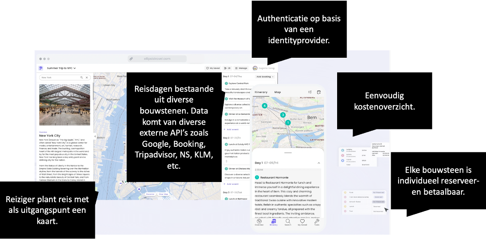

# SOEX Beroepsproduct
Casusbeschrijving voor SOEX: Solution Exploration

## Context 

Triptop moet een applicatie worden waarmee de manier waarop reizigers hun vakantietrip plannen en boeken verandert. In plaats van dat reizigers afhankelijk zijn van een reisagent, willen ze een online applicatie aanbieden waarmee reizigers zelf hun reis kunnen samenstellen, boeken, aanpassen en betalen. Deze applicatie moet gebruiksvriendelijk zijn en de mogelijkheid bieden om verschillende bouwstenen van een reis te combineren.

Dit project dient als een eerste verkenning van de technische mogelijkheden, de architectuur en het domein van de applicatie. Daarnaast dient het project een indicatie te geven van de geschiktheid van het Deno als ontwikkelplatform voor deze applicatie en in hoeverre developers zich snel genoeg kunnen bekwamen met deze technologie. 

## Vakantieplan app: Triptop

Ontwerp een online applicatie waarmee een vakantietrip gepland kan worden, een site waarop je zelf alles bij elkaar klikt. Waar je nu als reiziger naar een (virtueel) reisbureau gaat die alle opties/mogelijkheden voor je uitzoekt en op elkaar afstemt, verschuift die rol van reisagent nu naar de reiziger. De reisagent is daarmee tweedelijns support geworden die je zou kunnen raadplegen als je er zelf niet uitkomt of iemand waarmee je het uiteindelijke reisplan kunt bespreken i.v.m. risico's. Ondanks de [voordelen](https://fd.nl/samenleving/1548189/in-opkomst-het-fysieke-reisbureau?gift=wqenk) van een fysiek reisbureau is de trend dat reizigers steeds meer zelf hun reis samenstellen.

Deze applicatie is geïnspireerd op [Ellipsis Travel](https://www.ellipsistravel.com/), een online reisplatform dat reizen op maat aanbiedt. Triptop is gecharmeerd van dit idee en werd enthousiast van de mogelijkheden die dit platform biedt:

- Reizigers kunnen zelf hun reis samenstellen door verschillende bouwstenen te combineren.
- Reizigers kunnen zelf hun reis boeken.
- Reizigers kunnen zelf hun reis annuleren.
- Reizigers kunnen zelf hun reis aanpassen.
- Reizigers kunnen zelf hun reis betalen.
- Reizigers kunnen hun reisstatus bewaren zonder dat ze een extra account hoeven aan te maken, hiervoor is een centrale _identity provider_ beschikbaar waar je met je Google, Microsoft, AirBnb etc. account op kunt inloggen.

Triptop wil een soortgelijke applicatie ontwikkelen, maar dan gericht op de Nederlandse markt. De userinterface zou veel weg mogen hebben van Ellipsis Travel, maar dan met een Nederlandse touch. Alhoewel het maken van de webapplicatie zelf, in bijzonder het front-end voor deze opdracht buiten scope is geeft de volgende UI-schets een idee van de mogelijkheden:

Een reis bestaat uit verschillende bouwstenen die aan elkaar gekoppeld kunnen worden en die samen een trip vormen waarbij de route langs alle bouwstenen bepaald moet kunnen worden. 

Mogelijke bouwstenen zijn 
- Overnachting (bijv. Booking.com, Airbnb, eigen beheer)
- Vervoer tussen overnachtingen (bijv. treinen via NS of Deutsche Bahn, vliegtuig via KLM)
- Excursies / activiteiten (bijv. via GetYourGuide, Tripadvisor)
- Eten en drinken (bijv. via Takeaway, Eet.nu)

De bouwstenen kunnen verschillende toestanden hebben: 
- Verzoek
- Gepland
- Geregeld
- Eigen beheer
- Niet uitvoerbaar

Elke instantie van een bouwsteen kan verschillende externe services nodig hebben. 
Voorbeeld:

- Overnachtingen: de ene wordt via booking geregeld, de andere is in eigen beheer
- Vervoer tussen de ene twee overnachtingen gaat met de auto (via google maps routeplannen), de andere gaat via de boot (via een veerdienst).

## Opdracht in hoofdlijnen

1. Ontwerp een eerste versie van het domeinmodel van de applicatie.
1. Ontwerp maken waarbij gebruik gemaakt moet worden van C4. Je werkt een of meerdere ontwerpvragen uit die per drietal verschillend zijn waardoor verschillende groepjes verschillende aspecten van de applicatie moeten uitwerken.
1. Leer jezelf de basis van denojs.
1. Werk een deelgebied uit.
1. Maak een proof of concpet van een design pattern
1. Maak een walking skeleton
1. Werk alles uit in een software guidebook, waarin je de keuzes die je hebt gemaakt toelicht en visualiseert.

## Ontwerpvragen

### Websockets

### JWT

### KV-store
