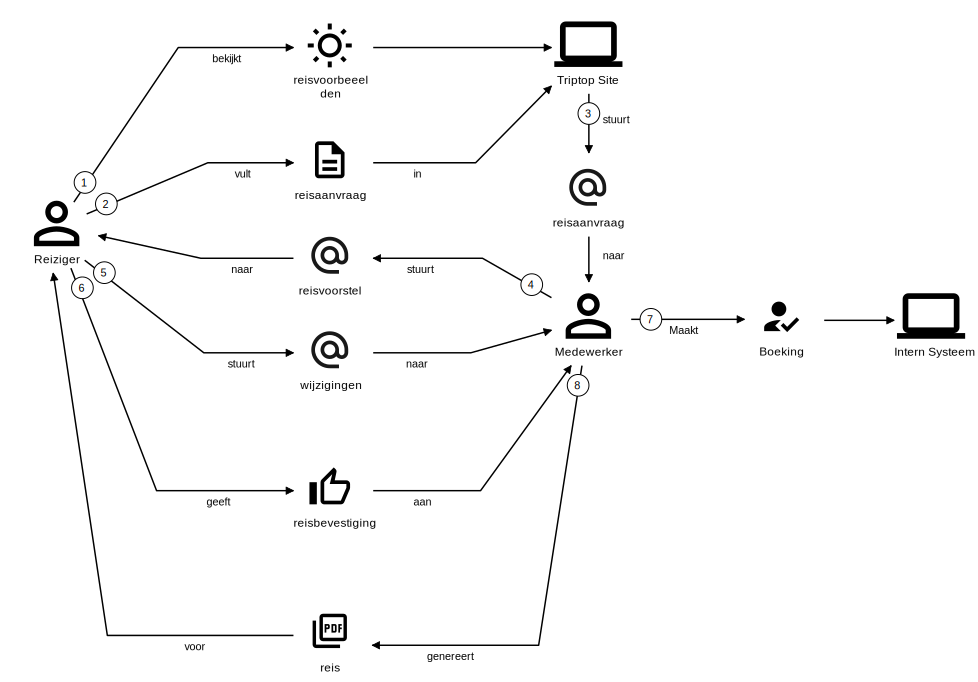

# Software Guidebook Triptop

## 1. Introduction
Dit software guidebook geeft een overzicht van de Triptop-applicatie. Het bevat een samenvatting van het volgende: 
1. De vereisten, beperkingen en principes. 
1. De software-architectuur, met inbegrip van de technologiekeuzes op hoog niveau en de structuur van de software. 
1. De ontwerp- en codebeslissingen die zijn genomen om de software te realiseren.
1. De architectuur van de infrastructuur.

## 2. Context

> [!IMPORTANT]
> Werk zelf dit hoofdstuk uit met context diagrammen en een beschrijving van de context van de software.

Toelichting op de context van de software inclusief System Context Diagram:
* Functionaliteit
* Gebruikers
* Externe systemen

## 3. Functional Overview

Triptop is een applicatie waarmee reizigers en medewerkers van een reisbureau gezamenlijk een reis kunnen samenstellen en beheren. Een reis bestaat uit een aantal dagen en op elke dag kan ingevuld worden aan de hand van verschillende soorten bouwstenen (bijvoorbeeld vervoer, verblijf en activiteiten). De applicatie helpt assisteert bij het komen tot een haalbare reis die zoveel mogelijk voldoet aan de wensen van de reiziger.

### 3.1 Domeininformatie

#### 3.1.1 Reis boeken as is

Hieronder is het proces van het uitzoeken van een reis tot aan het boeken weergegeven zoals dit op dit moment gaat.

Omdat we ons in deze fase richten op het samenstellen van de reis, is het daadwerkelijk betalen en uitvoeren van de reis niet opgenomen.

Zoals te zien 

#### 3.1.2 Reis boeken to be

### 3.1 User Stories

#### 3.1.1 User Story 1: Reis plannen

Als gebruiker wil ik een zelfstandig op basis van diverse variabelen (bouwstenen) een reis kunnen plannen op basis van mijn reisvoorkeuren (wel/niet duurzaam reizen, budget/prijsklasse, 's nachts reizen of overdag etc.) zodat ik op vakantie kan gaan zonder dat hiervoor een reisbureau benodigd is.

#### 3.1.2 User Story 2: Reis boeken

Als gebruiker wil ik een geplande reis als geheel of per variabele (bouwsteen) boeken en betalen zodat ik op vakantie kan gaan zonder dat hiervoor een reisbureau benodigd is.

#### 3.1.3 User Story 3: Reis cancelen

Als gebruiker wil ik een geboekte reis, of delen daarvan, kunnen annuleren zodat ik mijn geld terug kan krijgen zonder inmenging van een intermediair zoals een reisbureau.

#### 3.1.4 User Story 4: Reisstatus bewaren 

Als gebruiker wil ik mijn reisstatus kunnen bewaren zonder dat ik een extra account hoef aan te maken zodat ik mijn reis kan volgen zonder dat ik daarvoor extra handelingen moet verrichten.

#### 3.1.5 User Story 5: Bouwstenen flexibel uitbreiden

Als gebruiker wil ik de bouwstenen van mijn reis flexibel kunnen uitbreiden met een zelf te managen stap (bijv. met providers die niet standaard worden aangeboden zoals een andere reisorganisatie, hotelketen etc.) zodat ik mijn reis helemaal kan aanpassen aan mijn wensen.

#### 3.2.3 Domain Model

NOTE. DIT VERANDEREN DOOR DE BESCHRIJVING IN DE ODPRACHT.

NOTE DIT PLAATJE ERUIT EN PLAATJE VAN DE STUDENTEN ERIN

## 4. Quality Attributes

In dit project zijn de volgende kwaliteitsattributen belangrijk. Deze zijn afgeleid van de ISO 25010 kwaliteitsattributen. 

We willen weten in hoeverre de onderstaande kwaliteitsattributen implementeerbaar is en wat de consequenties zijn van attributen. Ook willen we weten welke knelpunten we eventueel tegenkomen.

https://www.iso25000.com/index.php/en/iso-25000-standards/iso-25010

Voordat deze casusomschrijving tot stand kwam, heeft de opdrachtgever de volgende ISO 25010 kwaliteitsattributen benoemd als belangrijk:

## Maintainability --> Modularity 

De applicatie bestaat zoveel mogelijk uit aparte componenten die onafhankelijk van elkaar kunnen worden ontwikkeld en getest. De domeinlogica moet in ieder geval onafhankelijk zijn van alle andere onderdelen.

## Maintainability --> Modifiability 

Er moeten nieuwe typen bouwstenen kunnen worden toegevoegd zonder dat de bestaande code aangepast hoeft te worden. 

## Functional Suitability --> Functional Correctness & Appropriateness

Wanneer twee gebruikers een reis bewerken, dan moet de applicatie ervoor zorgen dat de reis consistent blijft en dat de wijzigingen van de ene gebruiker zo min mogelijk ten kosten gaan van de wijzigingen van de andere gebruiker.

## Interaction Capability  --> Operability

Wijzigingen in de reis moeten direct bij de andere klant zichtbaar zijn zonder dat de pagina opnieuw geladen hoeft te worden.

## Security --> Confidentiality 

Een reis met alle bijbehorende bouwstenen mag alleen bekeken en aangepast worden door de klanten die aan de reis zijn gekoppeld en door de medewerker van Triptop die aan de reis is gekoppeld. 

## Flexibility --> Scalability & Replacibility

Het authenticatie/authorisatie-component en het websockets-component van de triptop applicatie moeten zo los mogelijk van de triptop applicatie staan. Er zijn plannen om deze componenten ook te gebruiken voor andere applicaties waardoor ze los van de Triptop-applicatie geschaald moeten worden. Daarnaast moet het mogelijk zijn om deze componenten te vervangen zonder bestaande code aan te passen.

## 5. Constraints

We willen in eerste instantie zo min mogelijk afhankelijkheden zijn van libraries en frameworks. We willen ervaren of we tegen belangrijke obstakels lopen. Daarom moet de applicatie voorlopig volledig in DenoJS worden gebouwd. Er kan wel gebruikt worden gemaakt van de DenoJS standaard libraries (ook als deze nog niet stable zijn).

> [!IMPORTANT]
> Beschrijf zelf de beperkingen die op voorhand bekend zijn die invloed hebben op keuzes die wel of niet gemaakt kunnen of mogen worden.

## 6. Principles

## Domain Driven Design

De applicatie moet gebruikt de tactical patterns uit DDD waaronder Value Objects, Entities, Aggregates en Repositories. Alle concurency-problemen die optreden bij het gelijktijdig bewerken van een reis lossen we op met het gebruik van aggregates en optimistic locking.

## Domain-Expressive Communication

Berichten tussen onderdelen van de applicatie moeten zoveel mogelijk concepten en begrippen uit het domein gebruiken.

## UI als pure functie van de state

De gebruikersinterface wordt opgebouwd als een directe functie van de huidige UI-state. De opbouw van de trip-UI (bijvoorbeeld de lijst van reis- en verblijfcomponenten) moet volledig worden aangestuurd door een JavaScript-object dat de trip-state bevat. 

> [!IMPORTANT]
> Voeg toe: de ontwerpprincipes die je hebt onderzocht.
> 
> Voeg ook toe of alle principes toepasbaar zijn, of dat we principes moeten afwegen tegen elkaar, of tegen quality attributes.

## 7. Software Architecture

###     7.1. Containers

> [!IMPORTANT]
> Voeg toe: Container Diagram plus een Dynamic Diagram van een aantal scenario's inclusief begeleidende tekst.

###     7.2. Components

> [!IMPORTANT]
> Voeg toe: Component Diagram plus een Dynamic Diagram van een aantal scenario's inclusief begeleidende tekst.

###     7.3. Design & Code

> [!IMPORTANT]
> Voeg toe: Per ontwerpvraag een Class Diagram plus een Sequence Diagram van een aantal scenario's inclusief begeleidende tekst.

## 8. Architectural Decision Records

> [!IMPORTANT]
> Voeg toe: 3 tot 5 ADR's die beslissingen beschrijven die zijn genomen tijdens het ontwerpen en bouwen van de software.

### 8.1. ADR-001 TITLE

> [!TIP]
> These documents have names that are short noun phrases. For example, "ADR 1: Deployment on Ruby on Rails 3.0.10" or "ADR 9: LDAP for Multitenant Integration". The whole ADR should be one or two pages long. We will write each ADR as if it is a conversation with a future developer. This requires good writing style, with full sentences organized into paragraphs. Bullets are acceptable only for visual style, not as an excuse for writing sentence fragments. (Bullets kill people, even PowerPoint bullets.)

#### Status

> [!TIP]
> A decision may be "proposed" if the project stakeholders haven't agreed with it yet, or "accepted" once it is agreed. If a later ADR changes or reverses a decision, it may be marked as "deprecated" or "superseded" with a reference to its replacement.

#### Context 

> [!TIP]
> This section describes the forces at play, including technological, political, social, and project local. These forces are probably in tension, and should be called out as such. The language in this section is value-neutral. It is simply describing facts about the problem we're facing and points out factors to take into account or to weigh when making the final decision.

## Considered Options

> [!TIP]
> This section mentions the possible options as headers in the second, third, etc. column. The forces in the left column are criteria (requirements, quality attributes, other forces like costs, learning curve, cultural, political or ethical factors that we can use to make the decision. 

| Forces                                        |  Aspect 1 << decided >>      |  Aspect 2 << discarded >>             |
|-----------------------------------------------|----------------------------|--------------------------------------|
| Force 1 (ASR of aanvullende force)            |   --/-/?/+/++ (incl. bron) |    --/-/?/+/++ (incl. bron)          |
| Force 2 (ASR of aanvullende force)            |   --/-/?/+/++ (incl. bron) |    --/-/?/+/++  (incl. bron)         |
| Force 3 (ASR of aanvullende force)            |   --/-/?/+/++ (incl. bron) |    --/-/?/+/++  (incl. bron)         |
| Force 4 (ASR of aanvullende force)            |   --/-/?/+/++ (incl. bron) |    --/-/?/+/++  (incl. bron)         |

#### Decision

> [!TIP]
> This section describes our response to the forces/problem. It is stated in full sentences, with active voice. "We decided to use option X because of …"

#### Consequences 

> [!TIP]
> This section describes the resulting context, after applying the decision. All consequences should be listed here, not just the "positive" ones. A particular decision may have positive, negative, and neutral consequences, but all of them affect the team and project in the future.

### 8.2. ADR-002 TITLE

> [!TIP]
> These documents have names that are short noun phrases. For example, "ADR 1: Deployment on Ruby on Rails 3.0.10" or "ADR 9: LDAP for Multitenant Integration". The whole ADR should be one or two pages long. We will write each ADR as if it is a conversation with a future developer. This requires good writing style, with full sentences organized into paragraphs. Bullets are acceptable only for visual style, not as an excuse for writing sentence fragments. (Bullets kill people, even PowerPoint bullets.)

#### Status

> [!TIP]
> A decision may be "proposed" if the project stakeholders haven't agreed with it yet, or "accepted" once it is agreed. If a later ADR changes or reverses a decision, it may be marked as "deprecated" or "superseded" with a reference to its replacement.

#### Context

> [!TIP]
> This section describes the forces at play, including technological, political, social, and project local. These forces are probably in tension, and should be called out as such. The language in this section is value-neutral. It is simply describing facts about the problem we're facing and points out factors to take into account or to weigh when making the final decision.

## Considered Options

> [!TIP]
> This section mentions the possible options as headers in the second, third, etc. column. The forces in the left column are criteria (requirements, quality attributes, other forces like costs, learning curve, cultural, political or ethical factors that we can use to make the decision.

| Forces                                        |  Aspect 1 << decided >>      |  Aspect 2 << discarded >>             |
|-----------------------------------------------|----------------------------|--------------------------------------|
| Force 1 (ASR of aanvullende force)            |   --/-/?/+/++ (incl. bron) |    --/-/?/+/++ (incl. bron)          |
| Force 2 (ASR of aanvullende force)            |   --/-/?/+/++ (incl. bron) |    --/-/?/+/++  (incl. bron)         |
| Force 3 (ASR of aanvullende force)            |   --/-/?/+/++ (incl. bron) |    --/-/?/+/++  (incl. bron)         |
| Force 4 (ASR of aanvullende force)            |   --/-/?/+/++ (incl. bron) |    --/-/?/+/++  (incl. bron)         |

#### Decision

> [!TIP]
> This section describes our response to the forces/problem. It is stated in full sentences, with active voice. "We decided to use option X because of …"

#### Consequences

> [!TIP]
> This section describes the resulting context, after applying the decision. All consequences should be listed here, not just the "positive" ones. A particular decision may have positive, negative, and neutral consequences, but all of them affect the team and project in the future.

### 8.3. ADR-003 TITLE

> [!TIP]
> These documents have names that are short noun phrases. For example, "ADR 1: Deployment on Ruby on Rails 3.0.10" or "ADR 9: LDAP for Multitenant Integration". The whole ADR should be one or two pages long. We will write each ADR as if it is a conversation with a future developer. This requires good writing style, with full sentences organized into paragraphs. Bullets are acceptable only for visual style, not as an excuse for writing sentence fragments. (Bullets kill people, even PowerPoint bullets.)

#### Status

> [!TIP]
> A decision may be "proposed" if the project stakeholders haven't agreed with it yet, or "accepted" once it is agreed. If a later ADR changes or reverses a decision, it may be marked as "deprecated" or "superseded" with a reference to its replacement.

#### Context

> [!TIP]
> This section describes the forces at play, including technological, political, social, and project local. These forces are probably in tension, and should be called out as such. The language in this section is value-neutral. It is simply describing facts about the problem we're facing and points out factors to take into account or to weigh when making the final decision.

## Considered Options

> [!TIP]
> This section mentions the possible options as headers in the second, third, etc. column. The forces in the left column are criteria (requirements, quality attributes, other forces like costs, learning curve, cultural, political or ethical factors that we can use to make the decision.

| Forces                                        |  Aspect 1 << decided >>      |  Aspect 2 << discarded >>             |
|-----------------------------------------------|----------------------------|--------------------------------------|
| Force 1 (ASR of aanvullende force)            |   --/-/?/+/++ (incl. bron) |    --/-/?/+/++ (incl. bron)          |
| Force 2 (ASR of aanvullende force)            |   --/-/?/+/++ (incl. bron) |    --/-/?/+/++  (incl. bron)         |
| Force 3 (ASR of aanvullende force)            |   --/-/?/+/++ (incl. bron) |    --/-/?/+/++  (incl. bron)         |
| Force 4 (ASR of aanvullende force)            |   --/-/?/+/++ (incl. bron) |    --/-/?/+/++  (incl. bron)         |

#### Decision

> [!TIP]
> This section describes our response to the forces/problem. It is stated in full sentences, with active voice. "We decided to use option X because of …"

#### Consequences

> [!TIP]
> This section describes the resulting context, after applying the decision. All consequences should be listed here, not just the "positive" ones. A particular decision may have positive, negative, and neutral consequences, but all of them affect the team and project in the future.

### 8.4. ADR-004 TITLE

> [!TIP]
> These documents have names that are short noun phrases. For example, "ADR 1: Deployment on Ruby on Rails 3.0.10" or "ADR 9: LDAP for Multitenant Integration". The whole ADR should be one or two pages long. We will write each ADR as if it is a conversation with a future developer. This requires good writing style, with full sentences organized into paragraphs. Bullets are acceptable only for visual style, not as an excuse for writing sentence fragments. (Bullets kill people, even PowerPoint bullets.)

#### Status

> [!TIP]
> A decision may be "proposed" if the project stakeholders haven't agreed with it yet, or "accepted" once it is agreed. If a later ADR changes or reverses a decision, it may be marked as "deprecated" or "superseded" with a reference to its replacement.

#### Context

> [!TIP]
> This section describes the forces at play, including technological, political, social, and project local. These forces are probably in tension, and should be called out as such. The language in this section is value-neutral. It is simply describing facts about the problem we're facing and points out factors to take into account or to weigh when making the final decision.

## Considered Options

> [!TIP]
> This section mentions the possible options as headers in the second, third, etc. column. The forces in the left column are criteria (requirements, quality attributes, other forces like costs, learning curve, cultural, political or ethical factors that we can use to make the decision.

| Forces                                        |  Aspect 1 << decided >>      |  Aspect 2 << discarded >>             |
|-----------------------------------------------|----------------------------|--------------------------------------|
| Force 1 (ASR of aanvullende force)            |   --/-/?/+/++ (incl. bron) |    --/-/?/+/++ (incl. bron)          |
| Force 2 (ASR of aanvullende force)            |   --/-/?/+/++ (incl. bron) |    --/-/?/+/++  (incl. bron)         |
| Force 3 (ASR of aanvullende force)            |   --/-/?/+/++ (incl. bron) |    --/-/?/+/++  (incl. bron)         |
| Force 4 (ASR of aanvullende force)            |   --/-/?/+/++ (incl. bron) |    --/-/?/+/++  (incl. bron)         |

#### Decision

> [!TIP]
> This section describes our response to the forces/problem. It is stated in full sentences, with active voice. "We decided to use option X because of …"

#### Consequences

> [!TIP]
> This section describes the resulting context, after applying the decision. All consequences should be listed here, not just the "positive" ones. A particular decision may have positive, negative, and neutral consequences, but all of them affect the team and project in the future.

### 8.5. ADR-005 TITLE

> [!TIP]
> These documents have names that are short noun phrases. For example, "ADR 1: Deployment on Ruby on Rails 3.0.10" or "ADR 9: LDAP for Multitenant Integration". The whole ADR should be one or two pages long. We will write each ADR as if it is a conversation with a future developer. This requires good writing style, with full sentences organized into paragraphs. Bullets are acceptable only for visual style, not as an excuse for writing sentence fragments. (Bullets kill people, even PowerPoint bullets.)

#### Status

> [!TIP]
> A decision may be "proposed" if the project stakeholders haven't agreed with it yet, or "accepted" once it is agreed. If a later ADR changes or reverses a decision, it may be marked as "deprecated" or "superseded" with a reference to its replacement.

#### Context

> [!TIP]
> This section describes the forces at play, including technological, political, social, and project local. These forces are probably in tension, and should be called out as such. The language in this section is value-neutral. It is simply describing facts about the problem we're facing and points out factors to take into account or to weigh when making the final decision.

## Considered Options

> [!TIP]
> This section mentions the possible options as headers in the second, third, etc. column. The forces in the left column are criteria (requirements, quality attributes, other forces like costs, learning curve, cultural, political or ethical factors that we can use to make the decision.

| Forces                                        |  Aspect 1 << decided >>      |  Aspect 2 << discarded >>             |
|-----------------------------------------------|----------------------------|--------------------------------------|
| Force 1 (ASR of aanvullende force)            |   --/-/?/+/++ (incl. bron) |    --/-/?/+/++ (incl. bron)          |
| Force 2 (ASR of aanvullende force)            |   --/-/?/+/++ (incl. bron) |    --/-/?/+/++  (incl. bron)         |
| Force 3 (ASR of aanvullende force)            |   --/-/?/+/++ (incl. bron) |    --/-/?/+/++  (incl. bron)         |
| Force 4 (ASR of aanvullende force)            |   --/-/?/+/++ (incl. bron) |    --/-/?/+/++  (incl. bron)         |

#### Decision

> [!TIP]
> This section describes our response to the forces/problem. It is stated in full sentences, with active voice. "We decided to use option X because of …"

#### Consequences

> [!TIP]
> This section describes the resulting context, after applying the decision. All consequences should be listed here, not just the "positive" ones. A particular decision may have positive, negative, and neutral consequences, but all of them affect the team and project in the future.
## 9. Deployment, Operation and Support

> [!TIP]
> Zelf beschrijven van wat je moet doen om de software te installeren en te kunnen runnen.