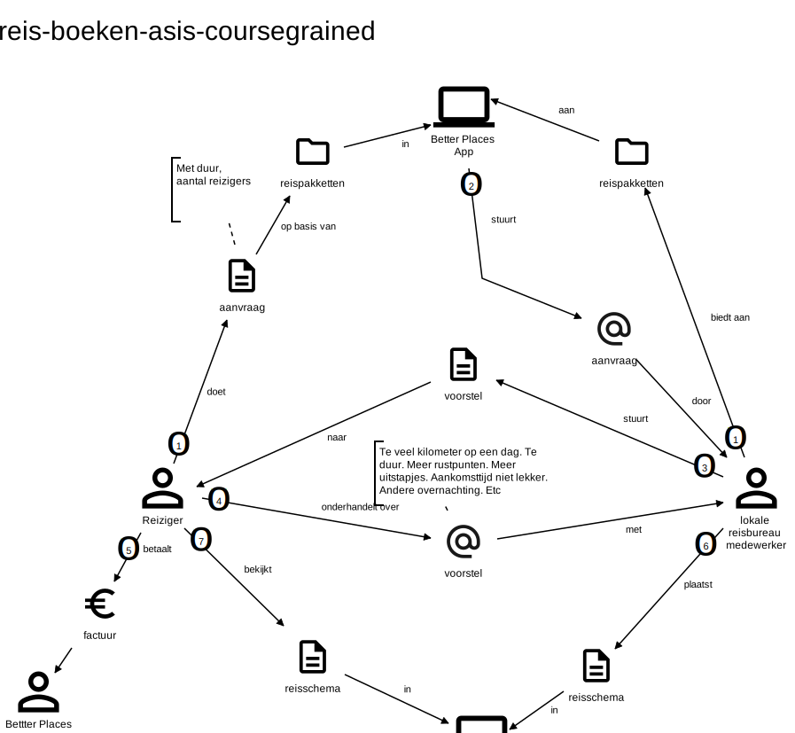

# Software Guidebook Triptop

## 1. Introduction
Dit software guidebook geeft een overzicht van de Triptop-applicatie. Het bevat een samenvatting van het volgende: 
1. De vereisten, beperkingen en principes. 
1. De software-architectuur, met inbegrip van de technologiekeuzes op hoog niveau en de structuur van de software. 
1. De ontwerp- en codebeslissingen die zijn genomen om de software te realiseren.
1. De architectuur van de infrastructuur en hoe de software kan worden geinstalleerd. 

## 1. Context

Toelichting op de context van de software inclusief System Context Diagram:
* Functionaliteit
* Gebruikers
* Externe systemen

## 1. Functional Overview

Om de belangrijkste features toe te lichten zijn er twee domain stories gemaakt en een overzicht van het domein in de vorm van een domeinmodel.

### 1.1 Domain Story Reis Boeken (AS IS)

### 1.1 Domain Story Reis Boeken (TO BE)

### 1.1 Domain Model

## 1. Quality Attributes

Voordat deze casusomschrijving tot stand kwam heeft de opdrachtgever de volgende ISO 25010 kwaliteitsattributen benoemd als belangrijk:
* Compatibility -> Interoperability (Degree to which a system, product or component can exchange information with other products and mutually use the information that has been exchanged)
* Reliability -> Fault Tolerance (Degree to which a system or component operates as intended despite the presence of hardware or software faults)
* Maintainability -> Modularity (Degree to which a system or computer program is composed of discrete components such that a change to one component has minimal impact on other components)
* Maintainability -> Modifiability (Degree to which a product or system can be effectively and efficiently modified without introducing defects or degrading existing product quality)
* Security -> Integrity (Degree to which a system, product or component ensures that the state of its system and data are protected from unauthorized modification or deletion either by malicious action or computer error)
* Security -> Confidentiality (Degree to which a system, product or component ensures that data are accessible only to those authorized to have access)

## 1. Constraints

Beperkingen die op voorhand bekend zijn die invloed hebben op keuzes die wel of niet gemaakt kunnen of mogen worden.

## 1. Principles

Een overzicht van de belangrijkste architecturele en design principes die zijn toegepast in de software.

## 1. Software Architecture
###     1. Containers

Container Diagram plus een Dynamic Diagram van een aantal scenario's.

###     1. Components

Component Diagram plus een Dynamic Diagram van een aantal scenario's.

## 1. Design & Code

Class Diagram plus een Sequence Diagram van een aantal scenario's.

## 1. Deployment, Operation and Support

Beschrijving van wat je moet doen om de software te installeren en te kunnen runnen.